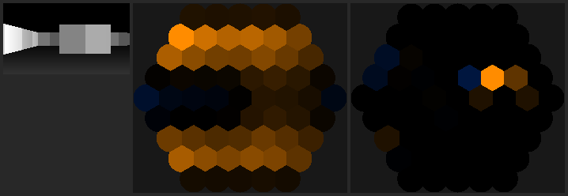

# fly-ds1

A *Drosophila* connectome wired to a video game: connectome → simulable
recurrent network → facetted eye → descending neurons → keyboard, trained with
PPO.

This repository implements the six-step roadmap end to end. It runs today,
offline, with a synthetic connectome and a synthetic arena; the real FlyWire
data and the real game plug into the same interfaces.

```bash
pip install -e ".[torch,rl]"
flyds1 doctor        # what is installed
flyds1 selftest      # run every step once, with checks
flyds1 info          # network, retina and encoder summary
flyds1 train --timesteps 100000
```

## The pipeline

| Step | What it does | Where it lives |
|---|---|---|
| 1 | Connectome data → neuron + synapse tables | `flyds1.connectome` (`codex.py`, `natverse.py`, `synthetic.py`) |
| 2 | Tables → signed weighted graph → simulable network | `flyds1.connectome.graph`, `flyds1.net` |
| 3 | Screen → ommatidia → Reichardt motion | `flyds1.vision` |
| 4 | Game interface (arena + real screen/keys) | `flyds1.envs` |
| 5 | Descending neurons → keys | `flyds1.motor` |
| 6 | PPO with the connectome frozen | `flyds1.agent`, `flyds1.pipeline` |

### 1. Connectome data

`flyds1.connectome.codex` reads Codex/FlyWire and MANC/male-CNS CSV exports
(column names are resolved through alias lists, so the same loader handles
`root_id`/`bodyId`, `nt_type`/`neurotransmitter`, `syn_count`/`weight`).
`flyds1 fetch` prints exactly how to get the files. `natverse.py` is the live
`fafbseg`/`navis` route for when you have a CAVE token.

Until then, `synthetic.py` generates a connectome with the structure the rest of
the pipeline needs: retinotopic columns on a hex lattice, ON/OFF pathways, the
T4/T5 offset motif (Mi9⁻ / Mi1⁺ / Mi4⁻), lobula plate tangential cells, looming
detectors, a recurrent central brain, and descending neurons. Plausible
structure, invented numbers — good for tests and for getting the plumbing right,
worthless as a statement about the animal.

### 2. Graph → network

`W[post, pre] = sign(nt_type[pre]) · synapse_count / norm`. The sign comes from
the presynaptic transmitter alone (Dale's law), so it is fixed and stays fixed.
Weak edges are dropped (default: <5 synapses, the Codex convention) and weights
are normalised per neuron's input budget.

Dynamics: `τ dv/dt = −v + W r + b + I`, `r = relu(v)`, forward Euler, in two
implementations that are checked against each other to 1e-10 — numpy
(`net/reference.py`, no gradients) and PyTorch (`net/rate_rnn.py`,
differentiable, connectome weights frozen).

Two things the connectome does **not** contain and this model therefore has to
supply:

* **A resting bias.** Photoreceptors are histaminergic, i.e. light *inhibits*
  L1/L2. With rectified rates and zero bias the network is silent by
  construction, no matter what is on screen (`test_zero_bias_would_silence_the_network`).
* **A weight scale.** At gain 1.0 the stimulus-driven variance drops by ~99%
  between the projection neurons and the descending neurons. `flyds1 tune`
  sweeps the gain and reports where the signal survives; the default (3.0,
  spectral radius ≈0.9) came out of that sweep.

### 3. Screen → eye

Each ommatidium integrates over a Gaussian acceptance cone (5.7° FWHM) on a hex
lattice at 5° spacing; the whole mapping is one sparse matrix, so a frame costs
a single sparse mat-vec. Photoreceptor coordinates come from hex column
annotations when the dataset has them, otherwise from a PCA fit to soma
positions (`retinotopy.py`).

Motion pre-processing is a bank of Hassenstein-Reichardt correlators along the
three lattice axes, with light adaptation (Weber contrast) and an ON/OFF split
in front. Verified direction-selective in `tests/test_vision.py`.



*Left: a frame from the arena. Middle: what the right eye's photoreceptors see
(orange = brighter than the adapting background, blue = darker). Right:
horizontal motion from the Reichardt detectors.*

### 4. Game interface

* `envs/arena.py` — a raycast first-person arena with textured walls and a
  chasing enemy, ~2000 steps/s. This is where you do the algorithm work.
* `envs/game.py` — the real bridge: `mss` screen capture, `pydirectinput`
  (Windows) or `xdotool` (X11) input, reward read off the HUD (health bars) plus
  optic flow as a progress proxy. **`dry_run=True` by default**: it computes
  everything and sends no input until you turn that off deliberately.

### 5. Descending neurons → keys

Descending neurons are the brain's only motor output, so they are the only thing
the decoder may read. The decoder is one linear layer (`net_arch={"pi": []}`
makes SB3's own action head *be* that layer) on standardised DN rates. Keeping
it linear is the point: a deep decoder would do the work the brain is supposed
to do.

### 6. Training

Frozen: the connectome. Trainable: the encoder (one gain and offset per
photoreceptor, one gain per T4/T5 subtype), the decoder, and — optionally — a
declared number of "plastic" edges standing in for connections the
reconstruction missed.

PPO replays its rollout buffer in shuffled minibatches, which a stateful
recurrent network cannot serve. Two honest options, both implemented:

| | `brain_location: policy` (default) | `brain_location: wrapper` |
|---|---|---|
| Brain runs in | the policy, unrolled over a k-frame stack from rest | the environment, state kept all episode |
| Memory | k frames (default 6 = 200 ms) | unbounded |
| Encoder trainable | yes | no (no gradient crosses the env boundary) |
| Cost | k× forward per step | 1× |

Full BPTT over an episode would need a recurrent policy (`sb3-contrib`'s
`RecurrentPPO`); that is the upgrade path, not something this repo pretends to
have.

## Where it stands

Measured on the synthetic connectome (rings=3, 1674 neurons, arena at 160×90):

* Signal reaches the descending neurons: stimulus-driven DN standard deviation
  `1.2e-1` at gain 3.0, versus `2.6e-3` at gain 1.0 (`flyds1 tune`).
* PPO runs at ~105 steps/s with the brain in the policy and moves the policy
  (`approx_kl` ≈ 5e-5, within ~4× of a plain MLP baseline on the same
  observations — the gap is the deliberately linear decoder).
* **It does not learn to play yet.** Over 60k PPO steps in the arena, every
  evaluation point stayed within noise of the untrained network (returns −13 to
  −16 against an untrained −13.1 ± 13.9). `docs/results.md` has the full table
  and where the next effort probably belongs — starting with a training budget
  an order of magnitude larger, and with un-handicapping the critic, which
  currently sees only the same 8 descending neurons as the policy.

## Honest limitations

* The default connectome is synthetic. Every quantitative claim above is about
  the generator, not about *Drosophila*.
* T4/T5 subtypes `a`–`d` are mapped to ±axis 0 and ±axis 1 of the hex lattice.
  The real subtypes are the four cardinal directions of the eye; `c`/`d` here are
  lattice diagonals.
* Both eyes are aimed at the monitor with a configurable azimuth offset. A real
  fly looks mostly sideways with ~17° of binocular overlap. This is the one place
  where anatomy was bent so the task can exist at all.
* Reward from a real game is read from HUD pixels and frame differences. Optic
  flow as "progress" is gameable by spinning in place, which is why it carries a
  small weight next to survival and damage.
* Modulatory transmitters (dopamine, serotonin, octopamine) have no sign in a
  rate model; their edges are dropped by default rather than given an invented
  one.

## Running a real game

Only against a **single-player, offline session you control**. Injecting input
into an online session is between you and the game's terms of service, and
anti-cheat systems are entitled to treat it as tampering. Keep the
`pydirectinput` failsafe (slam the mouse into a screen corner) enabled.

Real time is the hard ceiling: ~30 steps/s means a million-step PPO run takes a
day of actual play. Do the algorithm work in the arena.

## Development

```bash
pip install -e ".[torch,rl,dev]"
pytest              # 77 tests, ~15 s, no network access needed
                    # (2 skip: the Brian2 backend needs numpy<2)
flyds1 selftest     # numeric checks on every pipeline stage
```

Docs: [`docs/pipeline.md`](docs/pipeline.md) (how the parts fit together),
[`docs/data_sources.md`](docs/data_sources.md) (getting real connectome data),
[`docs/results.md`](docs/results.md) (what has actually been measured).
